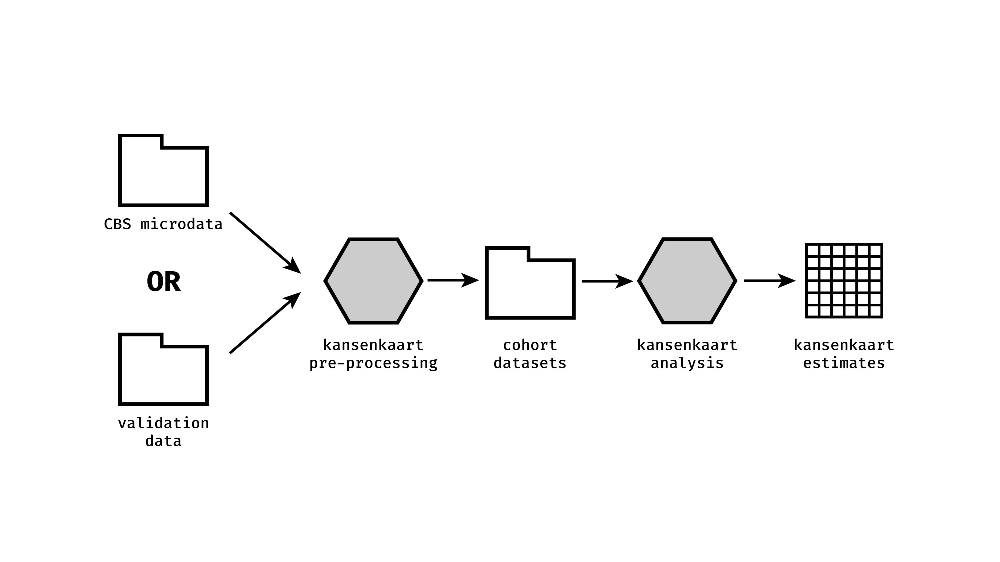

# Parallel estimation for the Kansenkaart on the OSSC

This repository holds the code for parallel estimation of the Kansenkaart project estimates on the ODISSEI Secure Supercomputer.

This is a work in progress!

## Steps to run the analysis

### Repository preparation
1. Add the cohort datasets resulting from the [`preprocessing pipeline`]() to the `data/` folder.
2. Point to the right resources in lines 8-9 in `02_create_grid.R`.
3. Ensure the right COROP code year (default: 2019) is being used in line 72 of `02_create_grid.R`.
4. Check that the right datasets are loaded in lines 33-37 of `03_array_job.R`.

### OSSC running
1. Create and store the `data/model_grid.feather` file by running `02_create_grid.R`. 
1. Perform a test run by running `Rscript 03_array_job.R 1` in bash on the OSSC
3. Check how many jobs are needed (`nrow(model_grid) / batch_size`)
2. Create an array job using `array_job.sh`. 

## Contact
This project is developed and maintained by the [ODISSEI Social Data Science
(SoDa)](https://odissei-data.nl/nl/soda/) team.

Do you have questions, suggestions, or remarks? File an issue in the issue
tracker or feel free to contact [Erik-Jan van
Kesteren](https://github.com/vankesteren)
([@ejvankesteren](https://twitter.com/ejvankesteren)) or [Helen Lam](https://github.com/Helenlam20).
